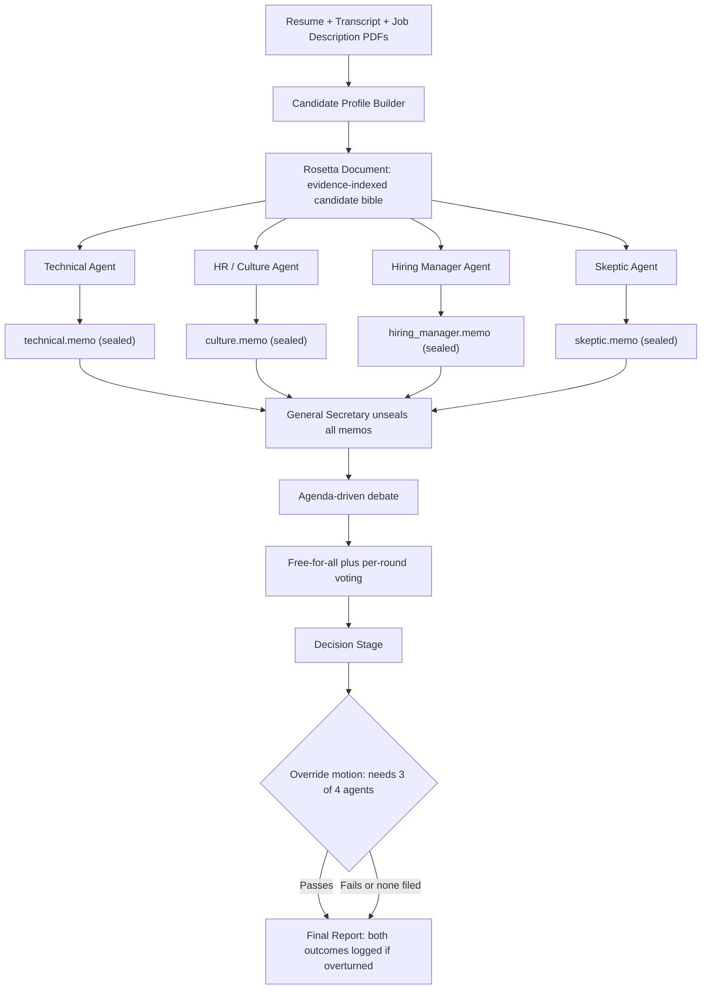

# PRD — Multi-Agent AI Interview Panel Simulator ("Project Rosetta")

| | |
|---|---|
| **Version** | v0.1 — Draft, open for AI review |
| **Owner** | Shubam (Prompt_Wars) |
| **Target build tool** | Google Antigravity CLI |
| **Source requirements** | Problem Statement: *Multi-Agent AI Interview Panel Simulator* (100-pt rubric) + Job Description: *AI Engineer — Agentic Systems, Cargonet AI* |
| **Last updated** | 2026-08-28 |

---

## Instructions for AI Collaborators (ChatGPT, Gemini, or any other reviewer)

This document is meant to be improved by more than one model. If you are reviewing or editing it:

1. Every requirement is tagged **[REQUIRED]**, **[DESIGN CHOICE]**, or **[STRETCH]**. `[REQUIRED]` items are sourced directly from the official Problem Statement or the human owner's explicit spec — do not delete, weaken, or silently reinterpret them. If you think one is genuinely wrong, flag it in §18 rather than removing it.
2. `[DESIGN CHOICE]` items are this draft's proposals for turning ambiguous instructions into buildable specs. These are fair game to improve — but log *why* in §18, tied to a specific rubric line from §4.
3. Add proposals as new rows in the **§18 Proposed Revisions** table. Don't rewrite prose sections directly — that makes conflicting edits from different models unmergeable.
4. Keep this file as plain, portable Markdown. No tool-specific syntax that only renders in one platform.
5. If you disagree with another AI's proposed revision, add a counter-row rather than deleting theirs.

---

## 1. Background

A hackathon build: construct a multi-agent AI system that reads one job description, one resume, and one interview transcript per candidate, and produces a hire / no-hire recommendation — without a ground-truth answer key. Two candidate packets are provided (Rohan Malhotra, Ananya Iyer) against a real-shaped JD for an AI Engineer role on a freight-ops multi-agent platform (planner/executor/reviewer pattern, Python + React + MongoDB, RAG/vector search, OCR, carrier integrations). The build is graded against a public 100-point rubric (§4).

## 2. Objectives & Non-Goals

**Objectives**
- **[REQUIRED]** Ingest JD + resume + transcript and produce an evidence-grounded recommendation via genuinely independent personas that debate before deciding.
- **[DESIGN CHOICE]** Maximize rubric coverage across all seven scoring categories with explicit, checkable traceability from design → rubric line.
- **[DESIGN CHOICE]** Make the entire process auditable — every intermediate artifact (memos, votes, transcript) persists to disk; nothing is silently overwritten.

**Non-Goals for v1 (MVP)**
- Not a production/legally-compliant hiring system (see §14).
- No requirement for a full React/MongoDB front end — a clean CLI + generated report satisfies "ease of use" without that time cost.
- Comparing the two candidates against each other is explicitly a bonus in the rubric, not required.
- Voice debate is Phase 6 only, attempted after the MVP works end-to-end at least once — the rubric calls it a bonus, and the problem statement explicitly warns against over-building agents at the expense of the debate step.

## 3. Actors

- **Human user**: runs the CLI, selects which candidate packet to process.
- **Candidate Profile Builder**: a parsing component, not a persona.
- **Four independent personas** (the rubric's "4 AI Personas," 20 pts): Technical Agent, HR/Culture Agent, Hiring Manager Agent, Skeptic Agent.
- **General Secretary**: a fifth, distinct orchestrator/judge role. It is *not* one of the "4 personas" the rubric grades for independence — it exists to satisfy the rubric's separate requirement that the final decision not be simple averaging (§4, 20 pts).

## 4. Rubric Alignment Table `[REQUIRED — keep accurate; this is the scoring contract]`

| Rubric criterion | Pts | Where it's satisfied |
|---|---|---|
| 4 personas actually distinct & independent | 20 | §7 (Agent Specs), §8 (sealed, isolated reasoning) |
| Debate quality + how the final decision is reached | 20 | §9 (Debate Protocol), §10 (Decision & Override) |
| Every decision traceable to evidence | 15 | §6 (citation-ID schema), §7 (evidence is a required output field) |
| System/code quality | 15 | §11 (stack, schema validation), §15 (tests) |
| Handles unclear/missing info sensibly | 10 | §12 (explicit `insufficient_evidence` state) |
| Ease and clarity of use | 10 | §11 (CLI UX), §10 (report format) |
| Creative / extra | 10 | Rosetta doc, General Secretary, sealed memos, override-motion mechanic, (stretch) voice |

## 5. System Architecture



**Access asymmetry (`[REQUIRED]`, from spec):** the Technical, HR/Culture, Hiring Manager, and Skeptic agents see **only** the Rosetta Document + JD — never the raw resume/transcript PDFs, and never each other's output before the debate stage. The General Secretary alone sees the raw resume, raw transcript, JD, *and* the Rosetta Document before the debate — but has **no independent opinion or score of its own** pre-debate.

> **Design note:** because the four line agents can only ever see the Rosetta Document, that document is a single point of failure for evidence coverage. Bias the Candidate Profile Builder toward over-including borderline-relevant detail rather than under-including — anything it omits is permanently invisible to every persona except the General Secretary.

## 6. Candidate Profile Builder → the "Rosetta Document"

**Inputs:** JD PDF, one resume PDF, one transcript PDF per candidate.

**Required extraction, per your spec:**
- *Resume:* education, per-role tenure (company, title, dates, duration), skills, certifications — each fact gets a stable citation ID.
- *Transcript — technical:* every Q/A pair, tagged as follow-up or not, with an explicit `influenced_by` link whenever a later answer visibly shifts because of an earlier question.
- *Transcript — behavioral:* friction-response events (mistakes, disagreements), and the Skeptic follow-up specifically, rated for hostility/defensiveness — **the rating is never a bare label; it must always be paired with the quote that justifies it.**
- *Transcript — ownership/hiring:* how directly vs. evasively each candidate addressed their specific resume gap (multi-agent production experience for Ananya; freight-domain depth for Rohan).
- *Cross-checks:* resume claims that get walked back or clarified in the interview (e.g., a title claim softened under questioning) are a first-class evidence item, not a footnote — this is exactly what the Skeptic and HR agents need to cite.
- Secondary signal: answer length (word count) at friction points, as a proxy for confidence/evasion — logged, never scored on its own.

**Output artifacts:** `rosetta/{candidate_id}.json` (machine-readable) + `rosetta/{candidate_id}.md` (human/agent-readable "bible").

**Example citation-indexed record shape:**

```json
{
  "candidate_id": "ananya_iyer",
  "resume_facts": {
    "education": [
      {"degree": "B.E. Information Technology", "year": 2019, "citation_id": "R-EDU-01"}
    ],
    "experience": [
      {
        "company": "Bridgepoint Systems",
        "role": "Software Engineer II",
        "start": "2021-06", "end": "present", "tenure_years": 4.2,
        "claims": [
          {"text": "Built RAG support-ticket assistant; ~40% accuracy gain, informal review only", "citation_id": "R-EXP-03"}
        ]
      }
    ],
    "skills": ["Python", "FastAPI", "MongoDB", "LangChain", "Chroma", "OCR/Tesseract", "Docker"],
    "certifications": []
  },
  "transcript_facts": {
    "technical_qa": [
      {"qid": "T-Q3", "topic": "multi-agent orchestration experience", "is_followup": false,
       "influenced_by": null, "answer_citation_id": "T-A3", "self_disclosed_gap": true}
    ],
    "behavioral": {
      "friction_event_citation_id": "T-A5",
      "skeptic_followup_citation_id": "T-A7",
      "skeptic_followup_word_count": 41,
      "skeptic_followup_defensiveness": "low"
    },
    "ownership_hiring_qa": [
      {"qid": "T-Q8", "gap_probed": "production multi-agent experience",
       "response_style": "direct_acknowledgment", "citation_id": "T-A8"}
    ]
  },
  "consistency_flags": []
}
```

## 7. Agent Specifications

Every persona shares one output contract:

```json
{
  "persona": "technical_agent",
  "candidate_id": "ananya_iyer",
  "score": 6,
  "confidence": "medium",
  "verdict_summary": "…",
  "strengths": [{"claim": "…", "citation_id": "R-EXP-03"}],
  "gaps": [{"claim": "…", "citation_id": "T-A3"}],
  "insufficient_evidence_items": []
}
```

**Technical Agent** — `[REQUIRED]` overrides all other considerations within its lane; scores pure technical/domain fit only, never tone or culture. Checklist ties directly to the JD: Python backend/API depth, hands-on (not tutorial-level) LLM/RAG experience, prompt engineering & model-routing exposure, basic React, and the nice-to-haves (freight/logistics, OCR, carrier/system integration). Rewards candidates who can explain *why* a design choice was made, not just *what* was built.

**HR / Culture Agent** — `[REQUIRED]` overrides all other considerations within its lane; focuses on subcommunication — tone, hedging language, answer-length trends at friction points, how directly gaps are owned vs. deflected — measured against the JD's implied culture ("not a build-it-once-and-move-on role," ownership under production pressure). Must act as devil's advocate: `[DESIGN CHOICE]` every HR/Culture memo includes at least one line arguing against its own leaning score, so the debate stage has genuine contrarian material to work with rather than a flat verdict.

**Hiring Manager Agent** — `[DESIGN CHOICE — filling a gap in the original spec]` your brief cuts off after "will focus," so this draft defines its lens explicitly: return-on-investment. Ramp-time cost, retention-risk signals (tenure pattern — e.g., three roles in 3.5 years vs. six years with escalating scope at one company), and a blunt "would I bet a year of payroll on this" judgment. Persona flavor (the "gilded age capitalist" tone you asked for) lives in the *prose* of `verdict_summary` — the score and `strengths`/`gaps` arrays must still cite real evidence like every other agent. Flavor is not license to skip citations.

**Skeptic Agent** — `[REQUIRED]` compiles the negative case across every dimension — technical, cultural, ownership. Actively hunts resume-vs-transcript contradictions, hedges, and the weakest answer in each transcript. Must still populate a `strengths` array (even if just one item) unless it can point to genuinely zero — an all-negative output with no evidentiary discipline is a caricature, not a persona.

**General Secretary (Orchestrator)** — `[DESIGN CHOICE]` this is how the design satisfies the rubric's "not simple averaging" requirement. Sole actor with access to the raw resume + transcript + JD + Rosetta doc pre-debate, but produces zero independent score before the debate stage. After the four sealed memos are finalized, it alone unseals and reads all four, builds the debate agenda, chairs the debate, and — per your instruction that it "will not be an enlightened centrist" — must render a genuine, decisive hire/no-hire call with clear reasoning at the end, not a hedge-everything non-answer.

## 8. Independent Reasoning Phase

**Sequence:** Rosetta doc + JD → four separate, isolated LLM calls (fresh session each, no shared history) → each persona writes `memos/{persona}.json` + `.pdf`.

**Sealing rule `[REQUIRED]`:** memos are invisible to other agents until either (a) the debate stage begins and the General Secretary unseals all four, or (b) an agent voluntarily quotes its own memo live during debate.

**Isolation test `[DESIGN CHOICE, see §15]`:** assert in code — not just in the prompt — that no persona's API call payload ever contains another persona's memo text before debate. This is also the artifact that satisfies the rubric's explicit instruction to "show the moment an agent's opinion changed... this proves it's a real multi-agent system, not one big prompt pretending to be four agents."

## 9. Debate Protocol

- **Agenda `[DESIGN CHOICE, operationalizing "prepare an agenda"]`:** the General Secretary reads all four sealed memos plus the Rosetta doc and extracts 3–6 highest-tension topics — points where memos disagree, or where a memo flags a JD-critical gap (e.g., "Agenda Item: production multi-agent experience gap").
- **Turn structure `[REQUIRED shape]`:** each agent gets exactly one response per agenda item; the General Secretary may issue a counter-question to any agent, granting one extra response.
- **Free-for-all:** after the agenda is exhausted, an open floor where any agent may address any other directly. `[REQUIRED]` at least one direct agent-to-agent rebuttal must occur and be logged.
- **Voting:** each round, all four agents (not the General Secretary) restate an integer 1–10 score plus one line on what changed their mind, citing the specific statement that moved them.
- **Auto-resolve `[REQUIRED, exact thresholds from spec]`:** unanimous ≥8 → auto-hire, skip to Decision Stage. Unanimous ≤4 → auto-reject, skip to Decision Stage.
- **"Maturity" heuristic `[DESIGN CHOICE — "GS believes the discussion has matured" isn't directly codeable, so]`:** end the free-for-all when, for two consecutive rounds, no agent's score moves by more than 1 point *and* no new citation is introduced. Hard ceiling: 6 rounds regardless, to bound cost/time.
- Every turn is logged verbatim:

```json
{
  "round": 2,
  "agenda_item": "Production multi-agent orchestration experience gap",
  "turns": [
    {"persona": "skeptic_agent", "statement": "…", "cites": ["T-A3"]},
    {"persona": "hiring_manager_agent", "statement": "…", "cites": ["T-A8"], "responds_to": "skeptic_agent"}
  ],
  "votes": {"technical_agent": 6, "hr_culture_agent": 7, "hiring_manager_agent": 5, "skeptic_agent": 4},
  "score_deltas_from_previous_round": {"hiring_manager_agent": "+1 after hearing T-A8 cited"}
}
```

## 10. Decision & Override Protocol

- **[REQUIRED]** The General Secretary alone renders hire/no-hire + a confidence level, reasoning over evidence and confidence-weighting across everything it has access to — never by averaging the four scores.
- **[REQUIRED, exact mechanic from spec]** Any one agent may file a motion to overturn. If ≥3 of the 4 agents (75% supermajority) support it, the decision is overturned. **Both** the original and the overturned decision, with full rationale for each, are retained in the final report — never silently replaced.
- **Output:** `decision.json` + `final_report.pdf`.

## 11. Final Report Spec

**[REQUIRED fields, from the problem statement]:** final recommendation, confidence level, strengths, concerns, and any disagreement between agents that was never fully resolved.

**[DESIGN CHOICE additions]:** full evidence appendix (every citation ID resolved to its exact source text), full debate transcript, vote history table, override-motion record if one was filed.

```json
{
  "candidate_id": "ananya_iyer",
  "final_recommendation": "hire | no_hire",
  "confidence_level": "low | medium | high",
  "strengths": [{"text": "…", "citation_id": "…"}],
  "concerns": [{"text": "…", "citation_id": "…"}],
  "unresolved_disagreements": [
    {"topic": "…", "positions": {"technical_agent": "…", "skeptic_agent": "…"}}
  ],
  "decision_path": {
    "auto_resolved": false,
    "override_motion_filed": false,
    "original_gs_decision": "hire",
    "final_decision_after_overrides": "hire"
  }
}
```

**Format:** PDF as primary deliverable (per your "compile a detailed pdf doc" language), with a Markdown/HTML mirror for fast reading — this covers "ease and clarity of use" (10 pts) without a web front end.

## 12. Edge Cases / Missing-Info Handling

- **[REQUIRED]** If a persona lacks sufficient evidence to judge an item, it must emit an explicit `insufficient_evidence` state — never a fabricated score. Enforce via schema: when `confidence == "insufficient_evidence"`, `score` must be `null`, not a placeholder number.
- Malformed/short PDFs → Candidate Profile Builder logs a parse-warning rather than failing silently.
- API failures/timeouts on any single agent call → retry once, then mark that persona's memo as `incomplete` and surface it plainly in the report rather than guessing.
- Free-for-all that never hits the maturity heuristic → hard 6-round cap forces the Decision Stage.

## 13. Tech Stack & Implementation Notes

`[DESIGN CHOICE]` Ship this as a **standalone Python application**, not something that depends on Antigravity's own chat/session state. Antigravity is the tool that *writes* the code; the resulting system should run independently afterward, e.g. `python run_panel.py --candidate ananya_iyer`, calling the Gemini API directly with a fresh, isolated session per persona call.

- Model calls: `google-genai` SDK.
- PDF/transcript extraction: `pdfplumber` or `pypdf`.
- Schema enforcement: `pydantic` for every JSON shape in §6/§7 — this is real engineering discipline and directly supports the "system/code quality" rubric line (15 pts).
- Report generation: `weasyprint` (HTML→PDF) or `reportlab`.
- State: plain JSON files per phase (`rosetta/`, `memos/`, `debate/`, `decision.json`) — simple, inspectable, crash-resilient, and makes every phase's artifact independently demoable.
- **Explicitly do not build the JD's full React/MongoDB stack for the MVP** — that describes Cargonet's *product*, not a requirement of this simulator. A clean CLI + generated report scores just as well on "ease of use" for a fraction of the time. If time remains after the MVP is solid, a small React results viewer is a fun optional callback to the JD (§16 territory, not MVP).

### Wiring this PRD into Antigravity CLI / Prompt_Wars

Antigravity CLI auto-loads an `AGENTS.md` (or `GEMINI.md`) rules file from the workspace root every session — that's the persistent way to attach this PRD, rather than re-pasting it each time. Practical steps:

1. Save this file and `ANTIGRAVITY_BUILD_PROMPT.md` at the root of the `Prompt_Wars` folder (or a `/docs` subfolder).
2. Create `AGENTS.md` at the repo root with a short pointer, e.g.:
   ```
   This project implements @PRD_interview_panel_simulator.md.
   Follow @ANTIGRAVITY_BUILD_PROMPT.md phase by phase.
   Never let any of the four independent agents read another agent's memo before the debate stage — this is a hard constraint, not a style preference.
   ```
   Antigravity resolves `@file` references inside rules files automatically, so the full PRD content loads every session without you retyping anything.
3. In any single prompt, you can also type `@` to open the path-suggestion overlay and pull a specific file in on demand.
4. Optional / exploratory: Antigravity CLI supports custom subagents defined as `.agents/{name}.md` files with YAML frontmatter (`subagent: true`, `model:`, `commandExecutionPolicy:`). You *could* prototype the five personas as literal Antigravity subagents this way — but for the graded submission, the standalone Python approach above is the safer bet, since it gives you code-enforced isolation and persistent artifacts rather than relying on the IDE session to behave.
5. Optional: wrap the phased build as an Antigravity Workflow (a saved `.md` file invoked via `/build-panel`) if you want a repeatable one-command re-run.

## 14. Compliance / Risk Note

This is a hackathon simulator evaluating two sample candidate packets — not a production hiring pipeline. A real-world version would need bias/fairness auditing, mandatory human sign-off, and legal review (e.g., EEOC guidance, and jurisdiction-specific AI-in-hiring rules such as NYC Local Law 144) before ever touching real candidates. Out of scope for this build; noted so the design doesn't accidentally imply otherwise.

## 15. Testing / Validation Plan

- **Isolation test:** assert no persona's API payload contains another persona's memo text pre-debate.
- **Traceability test:** every score-bearing field must resolve to a valid Rosetta citation ID; fail the build if not.
- **End-to-end smoke test:** both candidate packets run fully, unattended, through every phase.
- **Missing-info test:** feed a deliberately truncated transcript; confirm the system emits `insufficient_evidence` rather than a fabricated score.

## 16. Stretch — Voice Debate (Phase 6, bonus points only)

Explicitly a bonus in the rubric. Attempt only after §5–§11 work end-to-end at least once. Keep scope minimal: a per-persona TTS voice mapping played back over the logged debate transcript, not real-time interruption handling.

## 17. Assumptions Made By This Draft

- Hiring Manager Agent's focus (sentence was cut off in the original brief) → defined as ROI/retention-risk framing (§7).
- "Agenda" → GS-extracted top-tension topics from the four sealed memos (§9).
- "Discussion has matured" → concrete 2-round-stability heuristic with a 6-round hard cap (§9).
- Report format → PDF primary, Markdown/HTML mirror (§11).
- The full elaborate design (Rosetta doc, General Secretary, sealed memos, override motions) is kept in full, but phased so the ~90 rubric points that don't depend on the flourishes ship first.

## 18. Proposed Revisions (for other AI reviewers to extend)

| # | Proposed by | Date | Rubric item served | Change | Status |
|---|---|---|---|---|---|
| 1 | Claude (draft author) | 2026-08-28 | Creative/extra | Should the Hiring Manager use a quantified ramp-cost formula instead of qualitative-only judgment? | OPEN |
| 2 | Claude (draft author) | 2026-08-28 | Debate quality | Is a hard 6-round cap right, or should it scale with the number of agenda items? | OPEN |
| _ | _ | _ | _ | _(add rows here)_ | _ |

## 19. Changelog

- **v0.1 — 2026-08-28** — Initial draft synthesized from the owner's design brief, the official problem statement, and the job description, by Claude.
