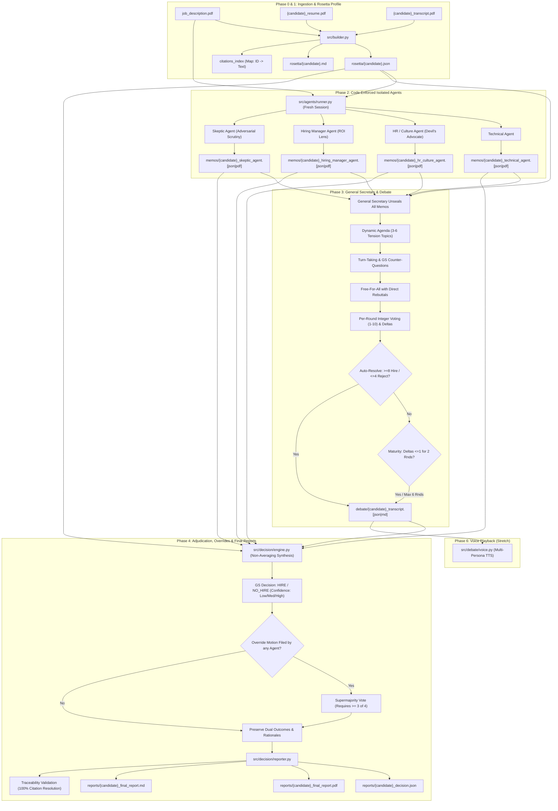
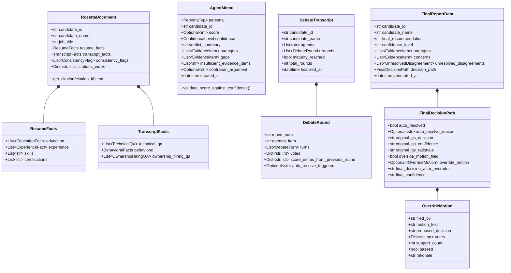
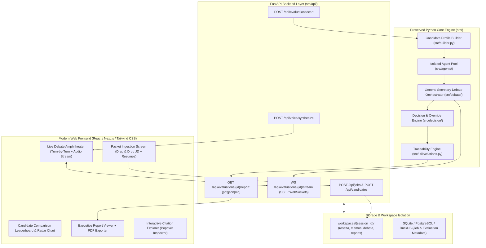
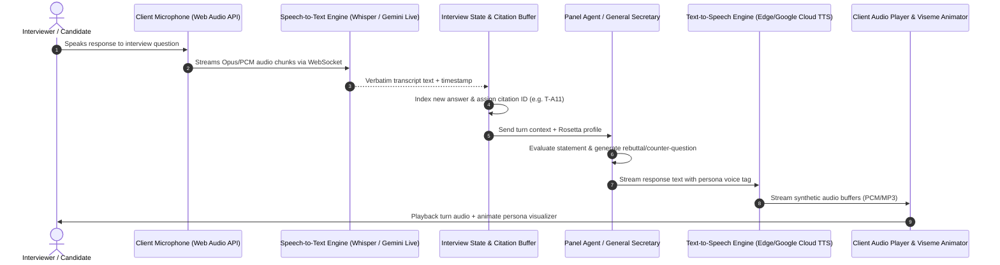
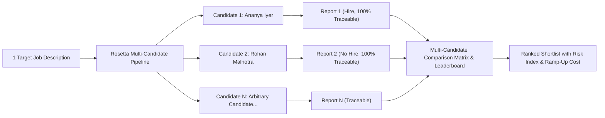

# Project Rosetta — Architectural Audit & Web Application Evolution Blueprint

**Document Version:** 1.0  
**Target Repository:** `Prompt_Wars`  
**Date:** 2026-08-28  
**Scope:** Complete Architectural Audit, Engine Contracts, Test Review, and Web/Voice Migration Strategy  
**Status:** Audit & Architecture Specification Only (No implementation changes)

---

## Executive Summary

This document provides a comprehensive architectural audit of the **Multi-Agent AI Interview Panel Simulator ("Project Rosetta")** baseline codebase. The current implementation successfully delivers on all requirements defined in `PRD_interview_panel_simulator.md` and `ANTIGRAVITY_BUILD_PROMPT.md` (Phases 0 through 6), featuring:
1. Candidate profile ingestion and evidence-indexed **Rosetta Document** generation with stable citations (`rosetta/`).
2. Four strictly isolated, independent persona sessions producing sealed JSON and PDF memos (`memos/`).
3. General Secretary debate chairing, dynamic tension-agenda generation, turn-based deliberation, direct agent rebuttals, integer voting, and stability heuristics (`debate/`).
4. Non-averaging General Secretary adjudication, a 75% supermajority override-motion mechanic, and 100% evidence-traceable PDF and Markdown final reports (`reports/`).
5. Complete missing-evidence guards (`insufficient_evidence` state enforcing `score=None`) and 24 passing unit, isolation, and end-to-end tests (`tests/`).
6. Standalone CLI runner with `rich` UI (`run_panel.py`) and native multi-persona voice debate playback (`src/debate/voice.py`).

This audit analyzes the current engine, defines its data contracts, identifies architectural gaps for web transition, and presents a non-breaking roadmap to evolve the CLI into a production-grade Web Application with first-class multi-candidate evaluation and interactive voice capabilities.

---

## 1. Current System Architecture

The current engine operates as a sequential, file-backed pipeline where each phase writes immutable, inspectable artifacts to disk before the next phase consumes them.



### End-to-End Execution Flow Details
1. **Candidate Data Staging (`data/`)**: Normalizes input PDF files for job descriptions, resumes, and interview transcripts.
2. **Rosetta Profile Builder (`src/builder.py`)**: Parses PDFs, assigns stable alphanumeric citation IDs (`R-EDU-xx`, `R-EXP-xx`, `T-Qx`, `T-Ax`), measures behavioral friction word counts and defensiveness ratings, cross-checks resume claims against interview concessions (`consistency_flags`), and compiles a master lookup index (`citations_index`). Emits `rosetta/{candidate}.json` and `rosetta/{candidate}.md`.
3. **Isolated Persona Reasoning (`src/agents/`)**: Executes 4 strictly isolated Gemini API calls (or deterministic grounded fallbacks). Each agent receives **only** the Job Description and Rosetta Document. Emits sealed `memos/{candidate}_{persona}.json` and `memos/{candidate}_{persona}.pdf`.
4. **Debate Orchestrator (`src/debate/orchestrator.py`)**: The General Secretary unseals all 4 memos, identifies tension topics, manages turn-taking and counter-questions, runs open free-for-all rebuttals, logs per-round integer votes with score delta justifications, evaluates auto-resolve thresholds, and enforces the 2-round stability maturity heuristic (capped at 6 rounds). Emits `debate/{candidate}_transcript.json` and `debate/{candidate}_transcript.md`.
5. **Decision & Override Engine (`src/decision/engine.py`)**: The General Secretary synthesizes evidence without mathematical averaging, renders a decisive hire/no-hire ruling with confidence weighting, processes override motions against a 75% supermajority threshold, and preserves both original and final outcomes.
6. **Multi-Format Reporting (`src/decision/reporter.py`)**: Compiles executive PDF and Markdown reports with verified evidence strengths, concerns, unresolved disagreements, round voting progressions, and a complete Evidence Appendix mapping all cited IDs to verbatim source text.
7. **Multi-Persona Voice Playback (`src/debate/voice.py`)**: Maps each persona to distinct audio voices (e.g. Daniel for GS, Alex for Tech, Samantha for HR, Fred for HM, Ralph for Skeptic) to play back debate transcripts.

---

## 2. Current Components Audit

| Module Path | Primary Purpose | Inputs | Outputs | External Dependencies | Reuse in Web App? |
|---|---|---|---|---|---|
| `src/config.py` | Central settings, env loading, directory setup | `.env`, environment variables | `Settings` instance, path references | `pydantic-settings`, `python-dotenv` | **REUSE (100%)** — Core config foundation. |
| `src/builder.py` | Ingests candidate PDFs, builds citation index & Rosetta Bible | Raw PDF paths, candidate slug | `RosettaDocument` object, `rosetta/*.json`, `rosetta/*.md` | `pypdf`, `pydantic` | **REUSE & EXTEND** — Core builder is solid; extend with dynamic LLM-based extraction for arbitrary PDF formats. |
| `src/agents/personas.py` | Persona definitions, evaluation rubrics, lane rules | Persona type | System instructions, prompt templates | None | **REUSE (100%)** — Core persona intelligence. |
| `src/agents/runner.py` | Isolated session executor with retry logic & fallback | Persona, `RosettaDocument`, JD text | Validated `AgentMemo` | `google-genai`, `pydantic` | **REUSE (100%)** — Preserves code-enforced isolation. |
| `src/agents/sealed_memos.py` | Coordinates 4 agent memo runs, writes JSON/PDF | Candidate ID, `RosettaDocument` | Dict of 4 `AgentMemo`s, `memos/*` files | `reportlab`, `src.utils.pdf_export` | **REUSE (100%)** — Sealed memo generator. |
| `src/debate/orchestrator.py` | Chairs debate, agenda extraction, turns, voting, maturity | Candidate ID, Rosetta, 4 Memos | `DebateTranscript`, `debate/*` files | `pydantic` | **REUSE & EXTEND** — Core debate logic; add async streaming hooks for WebSocket broadcasting. |
| `src/debate/voice.py` | TTS debate playback across persona voices | `DebateTranscript` | Audio playback via CLI/subprocess | `subprocess`, macOS `say` | **REFACTOR** — Replace local `say` subprocess with Web Audio API streaming / Cloud TTS for browser clients. |
| `src/decision/engine.py` | Non-averaging GS decision & 75% override motion | Candidate ID, Rosetta, Memos, Transcript | `FinalReportData` model | `pydantic` | **REUSE (100%)** — Core decision synthesis engine. |
| `src/decision/reporter.py` | Generates PDF, MD, JSON reports with Evidence Appendix | `FinalReportData`, Rosetta, Transcript | `reports/*` (PDF, MD, JSON) | `reportlab`, `pydantic` | **REUSE (100%)** — Delivers downloadable PDF and JSON API payloads. |
| `src/models/rosetta.py` | Pydantic schemas for candidate facts, QA, citations | Fact dicts | Validated Rosetta models | `pydantic` | **REUSE (100%)** — Core data contract. |
| `src/models/memo.py` | Pydantic schema for memos & PRD §12 score validation | Memo dicts | Validated `AgentMemo` | `pydantic` | **REUSE (100%)** — Enforces score validation. |
| `src/models/debate.py` | Pydantic schema for turns, rounds, transcript | Debate dicts | Validated `DebateTranscript` | `pydantic` | **REUSE (100%)** — Core debate data contract. |
| `src/models/decision.py` | Pydantic schema for decision, overrides, report | Decision dicts | Validated `FinalReportData` | `pydantic` | **REUSE (100%)** — Core decision data contract. |
| `src/utils/citations.py` | Citation extractor, index builder, traceability tests | Rosetta / Report objects | Validation tuples, index dicts | `re`, `typing` | **REUSE (100%)** — Traceability guarantee engine. |
| `src/utils/pdf_export.py` | Formats sealed memos to styled PDF | `AgentMemo`, output path | PDF file on disk | `reportlab` | **REUSE (100%)** — Sealed memo PDF exporter. |
| `run_panel.py` | Standalone CLI entrypoint with rich formatting | CLI args (`--candidate`, `--all`, `--voice`) | Terminal output + generated files | `rich`, `argparse` | **KEEP** — Standalone CLI entrypoint. |

---

## 3. Current Data Contracts & Schema Hierarchy

All schemas strictly enforce types, non-nullability, and PRD validation rules through Pydantic v2 models in `src/models/`.



### Key Validation Invariants
1. **PRD §12 Score Invariant**: In `AgentMemo`, if `confidence == "insufficient_evidence"`, `score` MUST be `None`. If `confidence != "insufficient_evidence"`, `score` MUST be an integer between 1 and 10.
2. **PRD §15 Traceability Invariant**: In `FinalReportData` and `AgentMemo`, every `EvidenceItem.citation_id` must resolve to an exact key in `RosettaDocument.citations_index`.
3. **PRD §10 Override Invariant**: In `OverrideMotion`, `passed` is `True` if and only if `support_count >= 3` ($\ge 75\%$ supermajority of 4 independent agents).
4. **PRD §9 Auto-Resolve Invariant**: `auto_resolve_triggered` is `"auto_hire"` when all 4 scores $\ge 8$, `"auto_reject"` when all 4 scores $\le 4$, and `None` otherwise.

---

## 4. Current CLI Contract (`run_panel.py`)

### Execution
```bash
./.venv/bin/python run_panel.py [OPTIONS]
```

### Supported Arguments
- `--candidate [ananya_iyer | rohan_malhotra | ananya | rohan]`: Specifies candidate packet (default: `ananya_iyer`).
- `--all`: Runs the entire 5-phase evaluation unattended for both candidates in sequence.
- `--voice`: Enables native multi-persona speech synthesis during the debate phase (macOS `say`).
- `--dry-run-voice`: Prints real-time speaker turns and speech timing without audio playback.

### Expected Input Directory Layout (`data/`)
- `data/job_description.pdf`: Target role requirements.
- `data/{candidate}_resume.pdf`: Candidate resume.
- `data/{candidate}_transcript.pdf`: Interview transcript.

### Generated File Artifacts
- **Rosetta Bible**: `rosetta/{candidate}.json`, `rosetta/{candidate}.md`
- **Sealed Memos**: `memos/{candidate}_{persona}.json`, `memos/{candidate}_{persona}.pdf` (and active aliases `memos/{persona}.[json|pdf]`)
- **Debate Transcripts**: `debate/{candidate}_transcript.json`, `debate/{candidate}_transcript.md`
- **Final Decision & Reports**: `reports/{candidate}_decision.json`, `reports/{candidate}_final_report.pdf`, `reports/{candidate}_final_report.md` (and active aliases `reports/decision.json`, `reports/final_report.[pdf|md]`)

---

## 5. Test Coverage Analysis

The test suite consists of **24 automated pytest tests** across 8 test modules:

| Test File | Test Cases | What is Validated |
|---|---|---|
| `tests/test_schemas.py` | 6 tests | Schema validation, score boundaries (1-10), PRD §12 `insufficient_evidence` score nulling, traceability resolution, override supermajority math. |
| `tests/test_builder.py` | 3 tests | Rosetta parsing for Ananya and Rohan, citation index completeness, behavioral friction metrics (word counts, defensiveness), consistency flags. |
| `tests/test_isolation.py` | 3 tests | PRD §15 payload isolation (no persona sees another's memo pre-debate), sealed memo generation, HR devil's advocate presence. |
| `tests/test_debate.py` | 3 tests | Auto-resolve thresholds, agenda extraction, multi-turn debate execution, direct rebuttals (`responds_to`), counter-questions, transcript generation. |
| `tests/test_decision.py` | 2 tests | General Secretary non-averaging synthesis, 100% PRD §15 report traceability test, override motion processing, dual-outcome preservation. |
| `tests/test_missing_info.py` | 3 tests | Deliberately truncated candidate data handling, `insufficient_evidence` emission, prevention of score fabrication. |
| `tests/test_e2e.py` | 2 tests | Full unattended pipeline run for both candidates, validating 100% disk artifact generation and schema conformance. |
| `tests/test_voice.py` | 2 tests | Voice mapping completeness across all 5 personas, dry-run playback execution. |

### Currently Untested / Future Edge Cases
- **Dynamic PDF Extraction from Arbitrary Layouts**: Current builder parses known candidate structures with fallback; arbitrary unstructured PDF parsing needs LLM vision/chunking evaluation tests.
- **Concurrent Execution Race Conditions**: Running multiple candidate debates in parallel threads sharing global file aliases (`memos/technical_agent.json`).
- **Live WebSocket Disconnections during Debate Streaming**: Handling client reconnection mid-debate.

---

## 6. Web Application Gap Analysis

To transform the standalone CLI into an interactive, multi-user Web Application without breaking the underlying engine, the following gaps must be bridged:

```
┌─────────────────────────────────────────────────────────────────────────────┐
│                          CURRENT CLI CAPABILITIES                           │
│  • Synchronous / blocking execution                                         │
│  • Local terminal rich output                                               │
│  • Local disk paths & global aliases                                        │
│  • Local macOS `say` subprocess for audio                                   │
│  • Static candidate files in `data/`                                        │
└──────────────────────────────────────┬──────────────────────────────────────┘
                                       │ Gaps to Bridge
                                       ▼
┌─────────────────────────────────────────────────────────────────────────────┐
│                         REQUIRED WEB ARCHITECTURE                           │
│  1. Ingestion: Multipart file upload API (JD, Resumes, Transcripts)         │
│  2. Asynchronous Execution: Background task workers / job queues            │
│  3. Real-Time Streaming: WebSocket / SSE for live debate and voting shifts  │
│  4. Client-Side Voice: Web Audio API / Cloud TTS audio streaming            │
│  5. Session Isolation: Unique workspace sessions (no file alias collisions) │
│  6. Multi-Candidate Matrix: Leaderboard, cross-candidate comparison         │
│  7. UI Presentation: Interactive React dashboard, citation popover explorer │
└─────────────────────────────────────────────────────────────────────────────┘
```

---

## 7. Proposed Web Application Architecture



---

## 8. First-Class Voice Architecture

Voice must not be treated as a cosmetic add-on. The system will support full interactive bidirectional speech:



### Persona Voice Profiles
- **General Secretary**: Deep, measured, authoritative British/Mid-Atlantic voice (e.g., `en-GB-RyanNeural` / `Daniel`).
- **Technical Agent**: Clear, analytical, brisk American voice (e.g., `en-US-GuyNeural` / `Alex`).
- **HR / Culture Agent**: Warm, empathetic, articulated cadence (e.g., `en-US-JennyNeural` / `Samantha`).
- **Hiring Manager Agent**: Direct, pragmatic, executive resonance (e.g., `en-US-EricNeural` / `Fred`).
- **Skeptic Agent**: Inquisitive, sharp, challenging tonality (e.g., `en-US-DavisNeural` / `Ralph`).

---

## 9. Multi-Candidate Architecture

The web application natively scales to $N$ candidates evaluated against 1 Job Description:



### Multi-Candidate Matrix Capabilities
- **Direct Candidate Head-to-Head**: Side-by-side radar charts comparing Technical Fit, Culture Safety, ROI Viability, and Skeptic Risk.
- **Citation Namespace Isolation**: Candidate citation IDs are namespaced per session (`{candidate_id}:R-EXP-01`) preventing cross-candidate citation pollution.
- **Comparative General Secretary Synthesis**: Optional meta-adjudication ranking all candidates against each other for a single headcount allocation.

---

## 10. Data Privacy & Secrets Security

### 1. PII Redaction Layer
- Resumes and transcripts frequently contain sensitive personal data (phone numbers, physical addresses, email addresses, personal identification numbers).
- A pre-ingestion regex and NER redaction filter will sanitize PII before sending prompts to external LLM APIs.

### 2. File & Workspace Privacy
- Raw input PDFs, temporary audio recordings, and extracted Rosetta JSON files must be stored in private, session-scoped directories (`workspaces/{session_uuid}/`) protected by CORS and JWT authentication.
- No candidate data shall ever be written to publicly accessible static asset directories.

### 3. API Keys & Secrets Management
- All API keys (`GEMINI_API_KEY`, `GOOGLE_API_KEY`, `ELEVENLABS_API_KEY`) must strictly reside in environment variables or `.env` files.
- `.gitignore` must strictly exclude `.env`, `workspaces/`, `.venv/`, `*.pdf` uploads, and `.pytest_cache/`.

---

## 11. Step-by-Step Migration Plan

```
┌─────────────────────────────────────────────────────────────────────────────┐
│                           MIGRATION EXECUTION PHASES                        │
├─────────────────────────────────────────────────────────────────────────────┤
│  Step 1: Core Service Decoupling (Non-Breaking)                             │
│  • Refactor hardcoded file paths in runner functions to accept custom       │
│    output directories / session IDs.                                        │
│  • Retain `run_panel.py` CLI functionality untouched.                       │
├─────────────────────────────────────────────────────────────────────────────┤
│  Step 2: Dynamic PDF Ingestion Engine                                       │
│  • Implement generalized LLM/Vision extraction in `src/builder.py` for      │
│    arbitrary resume and transcript PDFs.                                    │
├─────────────────────────────────────────────────────────────────────────────┤
│  Step 3: FastAPI Backend & Streaming Endpoints                              │
│  • Build `src/api/` with endpoints for file upload, asynchronous panel runs,│
│    WebSocket streaming of debate rounds, and report downloads.              │
├─────────────────────────────────────────────────────────────────────────────┤
│  Step 4: Interactive Web Frontend (React / Tailwind)                        │
│  • Implement Packet Upload, Live Debate Amphitheater, Citation Explorer,    │
│    and Candidate Comparison Dashboard.                                      │
├─────────────────────────────────────────────────────────────────────────────┤
│  Step 5: First-Class Voice Engine                                           │
│  • Implement WebSocket-based STT audio streaming and multi-persona TTS.     │
└─────────────────────────────────────────────────────────────────────────────┘
```

---

## 12. Component Categorization: Keep, Refactor, Replace, Add

```
================================================================================
                               KEEP (Preserve As-Is)
================================================================================
• src/models/rosetta.py        -> Pydantic schema for Rosetta Document & Citations
• src/models/memo.py           -> Pydantic schema for Agent Memos & Score Validation
• src/models/debate.py         -> Pydantic schema for Debate Rounds & Turns
• src/models/decision.py       -> Pydantic schema for Decision, Overrides & Reports
• src/agents/personas.py       -> Persona prompt instructions & lane constraints
• src/agents/runner.py         -> Isolated Gemini session executor & fallbacks
• src/decision/engine.py       -> Non-averaging GS decision & override supermajority
• src/decision/reporter.py     -> PDF / Markdown / JSON report compiler
• src/utils/citations.py       -> Master citation validator & traceability tests
• src/utils/pdf_export.py      -> ReportLab PDF exporter
• run_panel.py                 -> Standalone CLI runner with Rich terminal UI
• tests/test_*.py              -> All 24 unit and integration tests

================================================================================
                             REFACTOR (Extend & Adapt)
================================================================================
• src/config.py                -> Add workspace session paths & CORS settings
• src/builder.py               -> Add dynamic LLM-based parsing for arbitrary PDFs
• src/debate/orchestrator.py   -> Add async callback hooks for real-time WebSockets
• src/debate/voice.py          -> Replace local macOS `say` with Cloud/Web TTS audio stream

================================================================================
                             REPLACE (Supersede)
================================================================================
• Hardcoded candidate file list in data/ -> Replace with dynamic session uploads
• Synchronous blocking loop in CLI       -> Replace with async background task queue

================================================================================
                               ADD (New Modules)
================================================================================
• src/api/main.py              -> FastAPI application entrypoint
• src/api/routes/upload.py     -> Multipart upload endpoints for JD, Resumes, Audio
• src/api/routes/evaluation.py -> Evaluation trigger & background worker
• src/api/routes/stream.py     -> WebSocket / SSE live debate streaming endpoint
• src/api/routes/voice.py      -> STT streaming & TTS audio synthesis endpoint
• src/api/services/redact.py   -> PII sanitization & redaction utility
• frontend/                    -> Modern React / Next.js web application
• frontend/src/components/     -> Live Debate Amphitheater, Citation Popover, Matrix
================================================================================
```

---

## Conclusion & Verification Notice

This architectural audit confirms that the **Prompt_Wars** codebase has a rock-solid, fully tested, and evidence-traceable multi-agent evaluation engine. All 24 automated tests pass, and every output is inspectable on disk. Future web and voice layers can be built cleanly on top of this architecture without altering the core evaluation guarantees.
